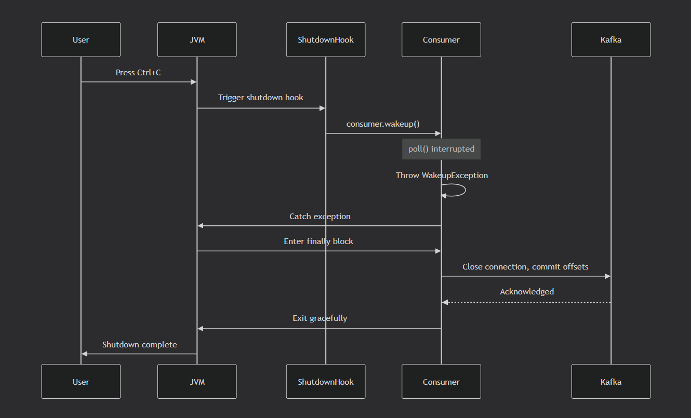

## We are working here with ConsumerDemoWithShutdown

### Concept: Graceful Shutdown

**What is Graceful Shutdown?**

A controlled way to stop a Kafka consumer that ensures:
- ✅ Current messages are fully processed
- ✅ Offsets are committed (no re-processing on restart)
- ✅ Consumer leaves the group cleanly (faster rebalancing)
- ✅ Resources are properly released

**Why Graceful Shutdown Matters:**

| Without Graceful Shutdown | With Graceful Shutdown |
|---------------------------|------------------------|
| Messages may be lost | ✅ All messages processed |
| Duplicate processing on restart | ✅ Offsets committed |
| Consumer group rebalance delayed | ✅ Clean departure |
| Resource leaks | ✅ Proper cleanup |

---

### How It Works

```
Normal Operation:
┌─────────────────────────────────────────────────────────┐
│  Consumer Running → Polling → Processing → Committing   │
└─────────────────────────────────────────────────────────┘

Ctrl+C Pressed:
┌─────────────────────────────────────────────────────────┐
│  1. Shutdown Hook Triggered                             │
│  2. consumer.wakeup() Called                            │
│  3. poll() throws WakeupException                       │
│  4. Catch exception → break loop                        │
│  5. finally block → consumer.close()                    │
│  6. Offsets committed, group left                       │
└─────────────────────────────────────────────────────────┘
```

---

### 1. Start Kafka in Docker

```bash
cd kafka-java-code-beginners
docker-compose up -d
```

### 2. Wait for Kafka to be ready (30 seconds)

```bash
docker-compose logs -f kafka | grep "started"
# Press Ctrl+C when you see it's ready
```

### 3. Verify Kafka is running

```bash
docker ps | grep kafka-java-broker
```

### 4. Create the topic with 3 partitions

```bash
docker exec -it kafka-java-broker kafka-topics \
  --bootstrap-server localhost:9092 \
  --create \
  --topic demo_topic_example \
  --partitions 3 \
  --replication-factor 1
```

### 5. Send some test messages first

```bash
# Send 10 test messages so consumer has something to process
docker exec -it kafka-java-broker kafka-console-producer \
  --bootstrap-server localhost:9092 \
  --topic demo_topic_example
```

Type:
```
Test message 1
Test message 2
Test message 3
Test message 4
Test message 5
# Ctrl+C to exit producer
```

### 6. Enable Multiple Consumer Instances in IDE

**IntelliJ IDEA:**
1. Run → Edit Configurations
2. Check ✅ "Allow multiple instances"
3. Click Apply → OK

**Eclipse:**
- Run → Run Configurations → Allow multiple instances

### 7. Run ConsumerDemoWithShutdown

#### Single Consumer Test (Terminal 1):
```
In IntelliJ: Run ConsumerDemoWithShutdown.main()
# Or via Maven:
 mvn exec:java -Dexec.mainClass="com.vbforge.consumer.ConsumerDemoWithShutdown"
```

**Expected output:**
```
🚀 Starting Kafka Consumer with Graceful Shutdown
🛡️ Demonstrating proper resource cleanup
━━━━━━━━━━━━━━━━━━━━━━━━━━━━━━━━━━━━━━━━━━━━━━
📌 Consumer instance ID: 23
✅ Subscribed to topic: demo_topic_example
   Consumer group: my-java-application
━━━━━━━━━━━━━━━━━━━━━━━━━━━━━━━━━━━━━━━━━━━━━━
💡 Press Ctrl+C to gracefully shut down
━━━━━━━━━━━━━━━━━━━━━━━━━━━━━━━━━━━━━━━━━━━━━━
📨 Received 5 message(s) (total: 5)
━━━━━━━━━━━━━━━━━━━━━━━━━━━━━━━━━━━━━━━━
📬 Message Details:
   Key:       null
   Value:     Test message 1
   Topic:     demo_topic_example
   Partition: 0
   Offset:    0
   Timestamp: 1733456789123
━━━━━━━━━━━━━━━━━━━━━━━━━━━━━━━━━━━━━━━━
... (more messages)
```

### 8. Test Graceful Shutdown

**Press Ctrl+C while consumer is running**

**Expected shutdown output:**
```
━━━━━━━━━━━━━━━━━━━━━━━━━━━━━━━━━━━━━━━━
⚠️ SHUTDOWN SIGNAL DETECTED (Ctrl+C)
   Instance: 23
   Calling consumer.wakeup() to interrupt poll()...
   Waiting for main thread to finish processing...
━━━━━━━━━━━━━━━━━━━━━━━━━━━━━━━━━━━━━━━━
👋 WakeupException caught - initiating graceful shutdown
   This exception is EXPECTED and NORMAL during shutdown
━━━━━━━━━━━━━━━━━━━━━━━━━━━━━━━━━━━━━━━━
🔒 Closing consumer...
   - Committing final offsets
   - Leaving consumer group
   - Closing network connections
✅ Consumer closed successfully
━━━━━━━━━━━━━━━━━━━━━━━━━━━━━━━━━━━━━━━━
🏁 Consumer finished - graceful shutdown complete!
━━━━━━━━━━━━━━━━━━━━━━━━━━━━━━━━━━━━━━━━
```

### 9. Test Multiple Consumer Instances with Shutdown

#### Terminal 1 (First Consumer):
```bash
mvn exec:java -Dexec.mainClass="com.vbforge.consumer.ConsumerDemoWithShutdown"
```

#### Terminal 2 (Second Consumer - while first is running):
```bash
mvn exec:java -Dexec.mainClass="com.vbforge.consumer.ConsumerDemoWithShutdown"
```

**Observe partition rebalancing:**
```
First consumer - Initial: Partitions [0, 1, 2]
Second consumer joins: Rebalancing
First consumer: Partitions [0, 1] (kept 2 partitions)
Second consumer: Partitions [2] (got 1 partition)
```

#### Terminal 3 (Send messages to see distribution):
```bash
docker exec -it kafka-java-broker kafka-console-producer \
  --bootstrap-server localhost:9092 \
  --topic demo_topic_example \
  --property parse.key=true \
  --property key.separator=:
```

Type messages with keys:
```
key1:Message for partition determined by key1
key2:Message for partition determined by key2
key3:Message for partition determined by key3
```

**Observe:** Different consumers receive messages based on partition assignment.

### 10. Shutdown One Consumer Gracefully

**Press Ctrl+C in Terminal 2 (second consumer)**

**Expected rebalancing output in Terminal 1:**
```
⚠️ Rebalancing triggered (consumer left)
   Previously owned partitions: [0, 1]
   New assignment: [0, 1, 2]  ← Gained partition 2
   Consumers continue processing without interruption!
```

---

## Verification Checklist

| Test | Command | Expected Result |
|------|---------|-----------------|
| Consumer running | Consumer logs | "Subscribed to topic" |
| Graceful shutdown | Press Ctrl+C | Shows shutdown sequence |
| WakeupException caught | Shutdown logs | "WakeupException caught" |
| Consumer close() called | Shutdown logs | "Closing consumer..." |
| Offsets committed | Check consumer group | Offset committed |
| Multiple instances | Run 2 consumers | Partitions split |
| Rebalancing on shutdown | Stop one consumer | Remaining consumer gets partitions |

---

## Troubleshooting

| Problem | Solution |
|---------|----------|
| Shutdown hook not triggered | Press Ctrl+C in terminal, not IDE stop button |
| WakeupException not caught | Ensure consumer.wakeup() is called in shutdown hook |
| Consumer not closing | Check finally block has consumer.close() |
| Messages re-processed on restart | Verify auto.commit is enabled or commit manually |
| Rebalancing slow | Set appropriate session.timeout.ms |
| "Allow multiple instances" not working | Check IDE run configuration settings |

---

## Graceful Shutdown Flow Diagram



---

## Key Takeaways

| Concept | Implementation | Why Important |
|---------|----------------|---------------|
| **Shutdown Hook** | `Runtime.getRuntime().addShutdownHook()` | Catches Ctrl+C signals |
| **consumer.wakeup()** | Interrupts blocking poll() | Allows exit from poll loop |
| **WakeupException** | Caught to exit main loop | Expected exception for shutdown |
| **consumer.close()** | Commits offsets, leaves group | Clean departure |
| **mainThread.join()** | Waits for main thread to finish | Ensures complete shutdown |

---

## Comparison: Graceful vs Forceful Shutdown

| Aspect | Forceful (Kill -9) | Graceful (Ctrl+C) |
|--------|-------------------|-------------------|
| **Message processing** | Interrupted mid-process | Completes current batch |
| **Offsets committed** | No (may lose data) | Yes |
| **Consumer group** | Stale membership | Clean leave |
| **Rebalancing time** | Slow (timeout) | Fast (immediate) |
| **Resource cleanup** | No | Yes |

---

## Best Practices

1. **Always implement graceful shutdown** in production consumers
2. **Test shutdown behavior** during development
3. **Monitor rebalancing time** with `session.timeout.ms`
4. **Use `consumer.wakeup()`** not `consumer.close()` directly
5. **Join main thread** in shutdown hook to wait for completion

---

## Next Steps

After understanding graceful shutdown, try:
1. **ConsumerDemoCooperative** - See incremental rebalancing on shutdown
2. **Manual offset commit** - Fine-grained control over commits
3. **Error handling** - Add retry logic for failed messages
4. **Metrics collection** - Track consumer lag and rebalancing

---

## Why This Matters in Production

Graceful shutdown is **essential** for production Kafka applications:

- **Rolling deployments** - Restart consumers without data loss
- **Auto-scaling** - Add/remove consumers cleanly
- **Failure recovery** - Proper offset commits prevent duplicates
- **Monitoring** - Clean shutdown logs enable better observability
- **Resource management** - No connection leaks or stuck threads

---

## Key Learning Points

1. **Graceful shutdown prevents data loss** - Offsets are committed
2. **consumer.wakeup()** is the proper way to interrupt poll()
3. **WakeupException is expected** during shutdown (not an error)
4. **Always close consumers** in finally block
5. **Join main thread** in shutdown hook for complete cleanup
6. **Test shutdown behavior** - Critical for production readiness

---