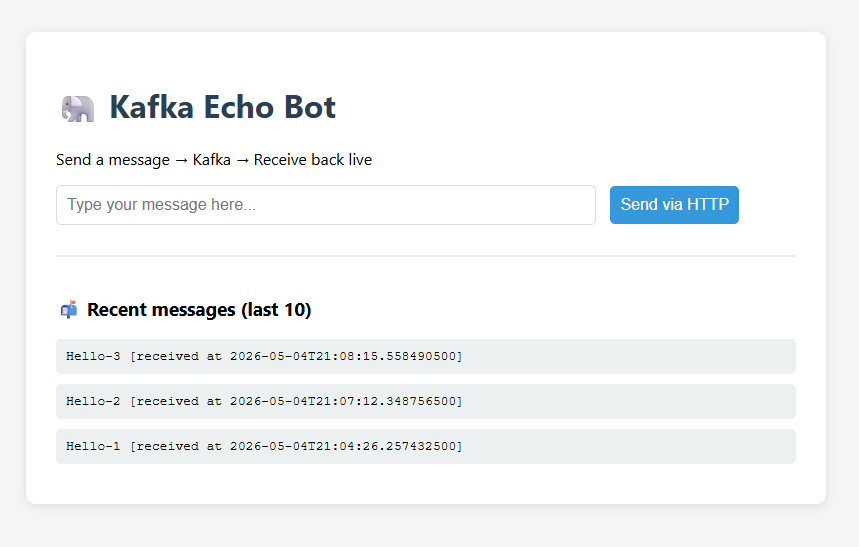

# Kafka Echo Bot



A real-time messaging application demonstrating Apache Kafka integration with Spring Boot, WebSocket, and Thymeleaf. 
Send messages via HTTP → Kafka → receive them instantly in the browser via WebSocket.

## 🎯 What this project demonstrates

- ✅ Kafka producer with idempotent configuration (`enable.idempotence=true`, `acks=all`)
- ✅ Kafka consumer with automatic offset commit
- ✅ Real-time WebSocket push using STOMP protocol
- ✅ Topic auto-creation with custom partition count (3 partitions)
- ✅ Clean separation of concerns (Controller → Service → Kafka)
- ✅ Live UI updates without page refresh

## 🛠️ Tech Stack

| Technology | Version |
|------------|---------|
| Java | 17 |
| Spring Boot | 3.5.10 |
| Apache Kafka | 3.9.1 (KRaft mode) |
| Thymeleaf | 3.1.3 |
| WebSocket | STOMP + SockJS |
| Maven | 3.x |

## 📋 Prerequisites

- **Java 17** or higher
- **Docker Desktop** (if using the provided docker-compose)
- **Maven** 3.6+
- Kafka broker running on `localhost:9092` (see Docker setup below)

## 🚀 Quick Start

### Option 1: Use Docker Compose (recommended)

```bash
# Clone and navigate to project
cd kafka-echo-bot

# Start Kafka + Conduktor UI
docker-compose up -d

# Wait 30 seconds for Kafka to be healthy, then:
mvn spring-boot:run
```

### Option 2: Connect to existing Kafka

If you already have Kafka running on `localhost:9092`, simply:

```bash
mvn spring-boot:run
```

## 🔐 Credentials (Local Demo Only)

The docker-compose.yml uses default credentials for local development:
- Conduktor: `admin@admin.com` / `admin`
- PostgreSQL: `conduktor` / `conduktor123`
- MySQL: `athlete` / `athlete123`

⚠️ These are for **local development only**. Never use these in production.


## 🌐 Access Points

| Service | URL | Credentials |
|---------|-----|-------------|
| Echo Bot UI | http://localhost:8080 | No auth |
| Conduktor (Kafka UI) | http://localhost:8085 | `admin@admin.com` / `admin` |

## 📁 Project Structure

```
kafka-echo-bot/
├── src/main/java/com/vbforge/kafka/bot/
│   ├── KafkaEchoBotApplication.java      # Spring Boot entry point
│   ├── config/
│   │   ├── CorsConfig.java               # CORS configuration
│   │   ├── KafkaConfig.java              # Topic definition
│   │   └── WebSocketConfig.java          # WebSocket/STOMP config
│   ├── controller/
│   │   └── MessageController.java        # HTTP endpoints
│   ├── service/
│   │   ├── ProducerService.java          # Kafka message producer
│   │   └── ConsumerService.java          # Kafka message consumer + WebSocket push
│   └── model/
├── src/main/resources/
│   ├── application.yml                   # Spring Boot configuration
│   └── templates/
│       └── index.html                    # Thymeleaf UI with WebSocket client
├── docker-compose.yml                    # Kafka + Conduktor containers
└── pom.xml                               # Maven dependencies
```

## ⚙️ Configuration Highlights

### Kafka Producer (`application.yml`)
```yaml
spring.kafka.producer:
  properties:
    enable.idempotence: true  # Exactly-once semantics foundation
    acks: all                 # Wait for all replicas
    retries: 3                # Automatic retry on failure
```

### Kafka Consumer
```yaml
spring.kafka.consumer:
  group-id: echo-bot-group
  auto-offset-reset: earliest
  enable-auto-commit: true    # Auto-commit (sufficient for this demo)
```

### Topic Configuration
```java
@Bean
public NewTopic echoTopic() {
    return TopicBuilder.name("echo-topic")
            .partitions(3)      # 3 partitions for scalability
            .replicas(1)        # Single broker in KRaft mode
            .build();
}
```

## 🔄 How It Works

```
┌─────────────┐     HTTP POST     ┌─────────────┐
│   Browser   │ ────────────────→ │   Spring    │
│   (Thymeleaf│                   │ Controller  │
│    + JS)    │                   └──────┬──────┘
│             │                          │
│             │                   ┌──────▼──────┐
│             │                   │  Producer   │
│             │                   │   Service   │
└──────▲──────┘                   └──────┬──────┘
       │                                 │
       │ WebSocket                       │ Kafka
       │ (/topic/messages)               │ produce
       │                                 │
┌──────┴──────┐                   ┌──────▼──────┐
│   Spring    │←──────────────────│    Kafka    │
│  Consumer   │   Kafka consume   │   Broker    │
│   Service   │                   │(echo-topic) │
└─────────────┘                   └─────────────┘
```

## 🧪 Test the Application

1. Open http://localhost:8080
2. Open **Browser Console** (F12) to see WebSocket connection logs
3. Type a message (e.g., "Hello Kafka!") and click "Send via HTTP"
4. Observe:
    - Console logs: `Connected to WebSocket`, `Sending message...`
    - Green alert banner appears with your message
    - Message appears in "Recent messages" list
5. Check Conduktor at http://localhost:8085 to verify messages in `echo-topic`

## 📊 Expected Log Output

```
2026-05-04T21:04:26.034 INFO  - Instantiated an idempotent producer.
2026-05-04T21:04:26.257 INFO  - Received message from Kafka topic [echo-topic]: Hello-1
2026-05-04T21:04:26.257 INFO  - Message pushed to WebSocket: /topic/messages
```

## 🐛 Troubleshooting

| Issue | Solution |
|-------|----------|
| `Connection refused: localhost:9092` | Start Kafka: `docker-compose up -d` |
| No messages appear in UI | Check browser console for WebSocket errors. Refresh page. |
| `UNKNOWN_TOPIC_OR_PARTITION` | Normal on first run — topic auto-creates within seconds |
| Port 8080 already in use | Change `server.port` in `application.yml` |
| WebSocket not connecting | Verify `CorsConfig.java` uses `.allowedOriginPatterns("*")` not `.allowedOrigins("*")` |

## 🧹 Clean Up

```bash
# Stop Spring Boot app (Ctrl+C)

# Stop and remove Docker containers
docker-compose down -v

# Remove volumes (clears Kafka data)
docker-compose down -v --remove-orphans
```

## 📚 Key Learning Outcomes

After studying this project, you should understand:

| Concept | Implemented as |
|---------|----------------|
| Producer creation | Spring Boot auto-configuration + manual topic bean |
| Consumer creation | `@KafkaListener` annotation |
| Idempotent producer | `enable.idempotence=true`, `acks=all` |
| Consumer group management | `group-id: echo-bot-group` |
| Partitions & replication | 3 partitions, 1 replica |
| WebSocket with STOMP | `@EnableWebSocketMessageBroker` + SockJS |
| CORS for WebSocket | `setAllowedOriginPatterns("*")` (Spring Boot 3+) |


## 📝 License

This project is part of a personal learning workshop.

## 👨‍💻 Author

**vbforge** — [GitHub](https://github.com/vbforge/workshop-kafka-apps)

---
