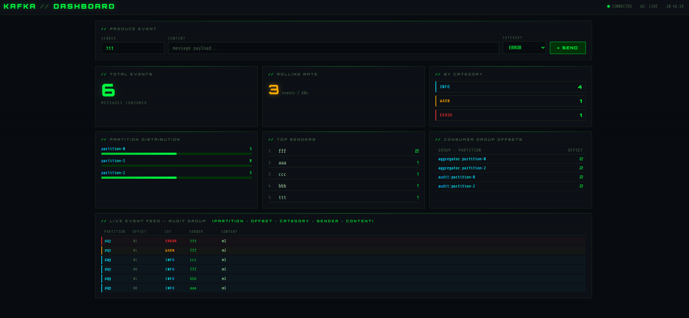

# Kafka Dashboard



A **real-time Kafka dashboard** demonstrating consumer groups, partition awareness, and in-memory aggregation. Send test events → watch them flow through Kafka → see live statistics update via WebSocket.

## 🎯 What this project demonstrates

- ✅ **Two independent consumer groups** consuming the same topic (`dashboard-aggregator-group` + `dashboard-audit-group`)
- ✅ **Partition awareness** — UI shows exactly which partition each message landed on
- ✅ **Different acknowledgment strategies** side-by-side: `BATCH` (aggregator) vs `MANUAL_IMMEDIATE` (audit)
- ✅ **In-memory aggregation** — rolling 60-second window, per-partition counters, top senders
- ✅ **Structured JSON payloads** with `JsonSerializer` / `JsonDeserializer`
- ✅ **Real-time WebSocket push** — server pushes stats every second (no polling)
- ✅ **Partition key routing** — same sender → same partition (hash-based)

## 🛠️ Tech Stack

| Technology | Version |
|------------|---------|
| Java | 17 |
| Spring Boot | 3.5.10 |
| Apache Kafka | 8.0.0 (KRaft mode) |
| Thymeleaf | 3.1.3 |
| WebSocket | STOMP + SockJS |
| Jackson | For JSON serialization |
| Maven | 3.x |

## 📋 Prerequisites

- **Java 17** or higher
- **Docker Desktop** (for Kafka + Conduktor)
- **Maven** 3.6+

## 🚀 Quick Start

### Option 1: Use Docker Compose (recommended)

```bash
# Clone and navigate to project
cd kafka-dashboard

# Start Kafka + Conduktor UI
docker-compose up -d

# Wait 30 seconds for Kafka to be healthy, then:
mvn spring-boot:run
```

### Option 2: Connect to existing Kafka

If you already have Kafka running on `localhost:9092`:

```bash
mvn spring-boot:run
```

## 🔐 Credentials (Local Demo Only)

- Conduktor UI: `http://localhost:8085` — no login required (auto-configured)
- PostgreSQL: `conduktor` / `conduktor123`
- Kafka broker: `localhost:9092`

⚠️ These are for **local development only**.

## 🌐 Access Points

| Service | URL | Purpose |
|---------|-----|---------|
| Dashboard UI | http://localhost:8080 | Main dashboard with live stats |
| Conduktor (Kafka UI) | http://localhost:8085 | View topics, consumer groups, offsets |

## 📁 Project Structure

```
kafka-dashboard/
├── src/main/java/com/vbforge/kafka/dashboard/
│   ├── KafkaDashboardApplication.java      # @EnableScheduling entry point
│   ├── config/
│   │   ├── KafkaConfig.java                # Two container factories (BATCH + MANUAL)
│   │   └── WebSocketConfig.java            # STOMP WebSocket config
│   ├── controller/
│   │   └── DashboardController.java        # HTTP endpoints + Thymeleaf
│   ├── consumer/
│   │   ├── AggregatorConsumer.java         # BATCH ack, stats aggregation
│   │   └── AuditConsumer.java              # MANUAL_IMMEDIATE ack, raw audit log
│   ├── service/
│   │   ├── ProducerService.java            # KafkaTemplate with partition key
│   │   ├── DashboardStatsService.java      # In-memory aggregation store
│   │   ├── AuditLogService.java            # Circular buffer (last 50 events)
│   │   └── DashboardBroadcaster.java       # @Scheduled WebSocket pusher
│   └── model/
│       ├── DashboardEvent.java             # JSON payload
│       ├── DashboardStats.java             # Aggregated snapshot
│       └── AuditEntry.java                 # Raw event with partition+offset
├── src/main/resources/
│   ├── application.yml                     # Kafka config (auto-commit: false)
│   └── templates/
│       └── dashboard.html                  # Thymeleaf UI + SockJS client
├── docker-compose.yml                      # Kafka + Conduktor containers
└── pom.xml
```

## ⚙️ Configuration Highlights

### Kafka Producer — JSON + Partition Key

```yaml
spring.kafka.producer:
  key-serializer: org.apache.kafka.common.serialization.StringSerializer
  value-serializer: org.springframework.kafka.support.serializer.JsonSerializer
  properties:
    enable.idempotence: true
    acks: all
```

```java
// Sender name as partition key → same sender always goes to same partition
kafkaTemplate.send(topic, sender, event);
```

### Two Consumer Groups — Different Ack Strategies

| Group | Ack Mode | Why |
|-------|----------|-----|
| `dashboard-aggregator-group` | `BATCH` | Losing a few stats on crash is acceptable |
| `dashboard-audit-group` | `MANUAL_IMMEDIATE` | Must persist audit entry before committing offset |

```java
// KafkaConfig.java
@Bean
public ConcurrentKafkaListenerContainerFactory<...> aggregatorListenerContainerFactory() {
    factory.getContainerProperties().setAckMode(ContainerProperties.AckMode.BATCH);
    return factory;
}

@Bean
public ConcurrentKafkaListenerContainerFactory<...> auditListenerContainerFactory() {
    factory.getContainerProperties().setAckMode(ContainerProperties.AckMode.MANUAL_IMMEDIATE);
    return factory;
}
```

### Topic Configuration

```java
@Bean
public NewTopic dashboardEventsTopic() {
    return TopicBuilder.name("dashboard-events")
            .partitions(3)   // Partition awareness is the whole point
            .replicas(1)
            .build();
}
```

## 🔄 How It Works

```
┌─────────────────────────────────────────────────────────────────────────────┐
│                              BROWSER (Client)                               │
│  ┌─────────────┐    ┌──────────────┐    ┌──────────────────────────────┐    │
│  │  Send Form  │    │  WebSocket   │    │  Dashboard UI                │    │
│  │  POST /send │    │  STOMP Client│    │  - Total: 127                │    │
│  └──────┬──────┘    └───────▲──────┘    │  - Partition 0: 45           │    │
│         │                   │           │  - Partition 1: 42           │    │
└─────────┼───────────────────┼───────────│  - Partition 2: 40           │    │
          │ HTTP              │ WebSocket │  - Last minute: 12           │    │
          │                   │           └──────────────────────────────┘    │
┌─────────▼───────────────────┼───────────────────────────────────────────────┐
│                         SPRING BOOT APPLICATION                             │
│  ┌───────────────────┐   ┌──┴──────────────────────────────────────────┐    │
│  │DashboardController│   │         DashboardBroadcaster                │    │
│  │  POST /send       │   │         @Scheduled(fixedRate = 1000)        │    │
│  └────────┬──────────┘   │  messagingTemplate.convertAndSend(...)      │    │
│           │              └──────────────────┬──────────────────────────┘    │
│           ▼                                 │                               │
│  ┌──────────────────┐                       │                               │
│  │  ProducerService │                       │ (pulls snapshot)              │
│  │  kafkaTemplate   │                       ▼                               │
│  │  send(topic, key)│              ┌──────────────────┐                     │
│  └────────┬─────────┘              │DashboardStats    │                     │
│           │                        │Service           │                     │
│           │                        │(in-memory store) │                     │
│           ▼                        └────────▲─────────┘                     │
│  ┌──────────────────────────────────────────┼─────────────────────────────┐ │
│  │              KAFKA BROKER                │                             │ │
│  │         dashboard-events (3 partitions)  │                             │ │
│  └──────────────────────────────────────────┼─────────────────────────────┘ │
│                       ▲                     │                               │
│                       │ consume             │ record()                      │
│           ┌───────────┴────────────┐        │                               │
│           │                        │        │                               │
│  ┌────────┴─────────┐   ┌──────────┴─────────┐                              │
│  │AggregatorConsumer│   │  AuditConsumer     │                              │
│  │ (BATCH ack)      │   │(MANUAL_IMMEDIATE)  │                              │
│  │ stats aggregation│   │  raw audit log     │                              │
│  └──────────────────┘   └────────────────────┘                              │
│                                                                             │
└─────────────────────────────────────────────────────────────────────────────┘
```

## 🧪 Test the Application

### 1. Open the Dashboard
http://localhost:8080

### 2. Open Browser Console (F12)
Watch WebSocket connection logs.

### 3. Send Test Events
Fill the form:
- **Sender**: `alice` (or any name)
- **Message**: `Hello Kafka!`
- **Category**: `INFO` / `WARN` / `ERROR`

### 4. Observe Live Updates

| UI Panel | Shows |
|----------|-------|
| Total Events | Running total count |
| Per-Partition Distribution | Which partition each sender routed to |
| Per-Category Breakdown | INFO / WARN / ERROR counts |
| Top 5 Senders | Leaderboard by message volume |
| Messages per Minute | Rolling 60-second rate |
| Live Event Feed | Raw audit log with partition + offset |
| Consumer Group Offsets | Current offset for each group |

### 5. See Partition Key Routing in Action

Send 10 messages from `alice` → all go to the **same partition** (e.g., partition 0).  
Send 10 messages from `bob` → all go to the **same partition** (may be different from alice's).  
Send 10 messages from `charlie` → distributed across partitions.

**Why?** Kafka hashes the key (`sender`) → `hash(key) % numPartitions`.

### 6. Check Conduktor
http://localhost:8085 → View `dashboard-events` topic, consumer group offsets, and messages.

## 📊 Expected Log Output

```
2026-05-06T10:15:23.123 INFO  - Sent event | sender=alice | topic=dashboard-events | partition=0 | offset=42
2026-05-06T10:15:23.456 DEBUG - Aggregator received | partition=0 | offset=42 | sender=alice | category=INFO
2026-05-06T10:15:23.457 DEBUG - Audit received | partition=0 | offset=42 | sender=alice
2026-05-06T10:15:23.458 DEBUG - Audit ack committed | partition=0 | offset=42
```

## 🐛 Troubleshooting

| Issue | Solution |
|-------|----------|
| `Connection refused: localhost:9092` | Start Kafka: `docker-compose up -d` |
| WebSocket not connecting | Check `WebSocketConfig` uses `.setAllowedOriginPatterns("*")` |
| No messages in audit feed | Verify `auto-offset-reset: earliest` in `application.yml` |
| All messages go to one partition | Working as designed — that's partition key routing! |
| Consumer lag shows in Conduktor | Normal after sending messages — offset moves as consumed |
| Port 8080 already in use | Change `server.port` in `application.yml` |

## 🧹 Clean Up

```bash
# Stop Spring Boot app (Ctrl+C)

# Stop and remove Docker containers
docker-compose down -v

# Remove volumes (clears Kafka data)
docker-compose down -v --remove-orphans
```

## 📚 Key Learning Outcomes

| Concept | Implemented as |
|---------|----------------|
| **Consumer groups** | Two independent groups on same topic |
| **Partition awareness** | `ConsumerRecord.partition()` in listeners |
| **Partition key routing** | `kafkaTemplate.send(topic, key, value)` |
| **Batch acknowledgment** | `AckMode.BATCH` — auto-commit after poll batch |
| **Manual acknowledgment** | `AckMode.MANUAL_IMMEDIATE` — explicit `ack.acknowledge()` |
| **In-memory aggregation** | `ConcurrentHashMap` + `AtomicLong` + rolling window |
| **Structured JSON** | `JsonSerializer` / `JsonDeserializer` |
| **WebSocket push pattern** | `@Scheduled` broadcaster (rate-limited) |
| **Two consumer factories** | Different ack modes for different use cases |

## 🎓 Why This Project Matters

The **Echo Bot** (Project 1) showed you *how* to produce and consume.  
The **Dashboard** (Project 2) shows you *why* Kafka design decisions matter:

- **Consumer groups** let multiple independent systems read the same data
- **Partition keys** control ordering and parallelism
- **Ack strategies** trade off safety vs performance
- **In-memory aggregation** is how real dashboards work (no DB needed)

## 📝 Next Steps

After mastering this project, explore:

1. **Project 3: kafka-order-logger** — exactly-once semantics, idempotent producer
2. **Project 4: kafka-shopping-cart** — compacted topics, event sourcing
3. **Project 5: kafka-dlq-visualizer** — dead letter queues, `@RetryableTopic`

## 👨‍💻 Author

**vbforge** — [GitHub](https://github.com/vbforge/workshop-kafka-apps)


---