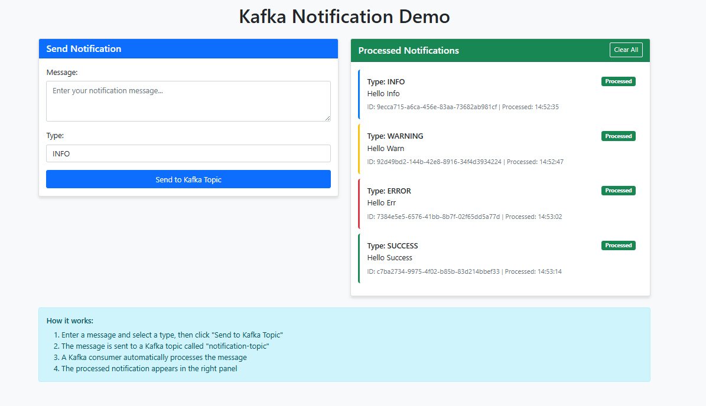
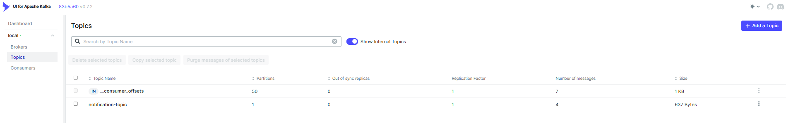
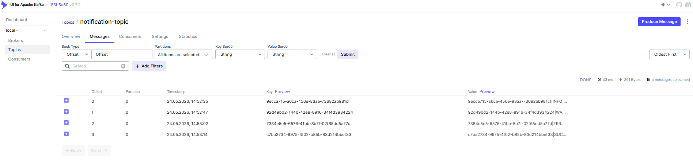

# Kafka Notification Demo with Spring Boot

A simple Spring Boot demo application demonstrating Apache Kafka (Kafka and Zookeeper using Docker) integration with Thymeleaf for sending and consuming notifications.

## 📸 Screenshots





## 📋 Prerequisites

- Java 17 or higher
- Maven 3.6+
- Docker and Docker Compose (for running Kafka)

## 🚀 Quick Start

### Step 1: Start Kafka Services

First, start Kafka and Zookeeper using Docker Compose:

```bash
docker-compose up -d
```

This will start:
- **Zookeeper** on port 2181
- **Kafka** on port 9092
- **Kafka UI** on port 8081 (optional web interface)

### Step 2: Create the Project Structure

Create the following directory structure:

```
kafka-notification-demo/
├── src/main/java/com/example/kafkanotificationdemo/
│   ├── KafkaNotificationDemoApplication.java
│   ├── controller/
│   │   └── NotificationController.java
│   ├── model/
│   │   └── Notification.java
│   └── service/
│       ├── NotificationProducer.java
│       └── NotificationConsumer.java
├── src/main/resources/
│   ├── application.properties
│   └── templates/
│       └── index.html
├── docker-compose.yml
└── pom.xml
```

### Step 3: Build and Run the Application

```bash
# Build the project
mvn clean install

# Run the application
mvn spring-boot:run
```

### Step 4: Access the Application

Open your browser and navigate to:
- **Application**: http://localhost:8080
- **Kafka UI** (optional): http://localhost:8081

## 🔧 How It Works

### Producer Flow
1. User submits a notification form on the web page
2. `NotificationController` receives the form data
3. `NotificationProducer` sends the message to Kafka topic `notification-topic`

### Consumer Flow
1. `NotificationConsumer` listens to the `notification-topic`
2. When a message arrives, it processes it (simulates 1-second processing time)
3. Processed notifications are stored in memory and displayed on the web page

### Key Components

- **Kafka Topic**: `notification-topic` - where messages are sent and consumed
- **Consumer Group**: `notification-group` - ensures message processing reliability
- **Message Format**: `id|type|message` - simple pipe-separated format

## 📝 Features

- **Send Notifications**: Use the web form to send different types of notifications
- **Real-time Processing**: Messages are processed automatically via Kafka consumers
- **Visual Feedback**: See processed notifications in real-time on the web interface
- **Multiple Notification Types**: INFO, WARNING, ERROR, SUCCESS

## 🛠️ Configuration

Key configuration in `application.properties`:

```properties
spring.kafka.bootstrap-servers=localhost:9092
spring.kafka.consumer.group-id=notification-group
app.kafka.topic.notification=notification-topic
```

## 🧪 Testing the Application

1. **Send a notification**:
   - Fill in the message field
   - Select a notification type
   - Click "Send to Kafka Topic"

2. **Watch the processing**:
   - The message will appear in the "Processed Notifications" panel
   - Check the console logs to see Kafka producer/consumer activity

3. **Monitor with Kafka UI** (optional):
   - Visit http://localhost:8081
   - Navigate to Topics → notification-topic
   - View messages and consumer groups

## 🔍 Logs to Watch

The application logs will show:
- Message production: `Sending notification to Kafka`
- Message consumption: `Received notification from Kafka`
- Processing completion: `Successfully processed notification`

## 🛑 Stopping the Services

To stop Kafka services:

```bash
docker-compose down
```

## 💡 Learning Points

This demo teaches:

1. **Kafka Producer**: How to send messages to Kafka topics
2. **Kafka Consumer**: How to listen and process messages from topics
3. **Spring Boot Integration**: Easy Kafka setup with Spring Boot starters
4. **Asynchronous Processing**: Decoupling message production from consumption
5. **Real-world Application**: Practical notification system example

## 🚨 Troubleshooting

**If the application can't connect to Kafka:**
- Ensure Docker containers are running: `docker-compose ps`
- Check if port 9092 is available: `netstat -an | grep 9092`
- Verify Kafka is healthy in Docker logs: `docker-compose logs kafka`

**If notifications aren't appearing:**
- Check application logs for any errors
- Verify the topic exists in Kafka UI
- Ensure the consumer group is active

This project provides a solid foundation for understanding Kafka with Spring Boot. You can extend it by adding features like message persistence, error handling, or different message formats!