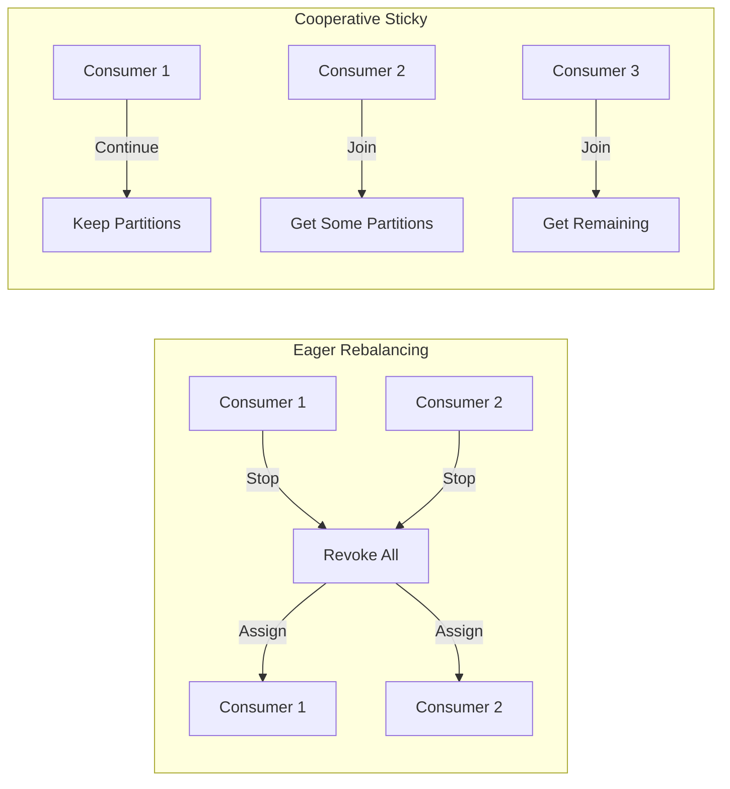

## We are working here with ConsumerDemoCooperative

### Concept: Cooperative Sticky Assignor (Incremental Rebalancing)

**What is Cooperative Sticky Assignor?**

A modern partition assignment strategy that performs **incremental rebalancing** instead of "stop-the-world" rebalancing.

**Traditional Eager Rebalancing (RangeAssignor / RoundRobinAssignor):**
```
All consumers STOP → Partitions revoked → Reassigned → All consumers START
↑                                      ↑
(downtime)                         (downtime)
```

**Cooperative Sticky Rebalancing:**
```
Consumer joins/leaves → Only affected partitions move → Other consumers CONTINUE
↑                                ↑
(minimal downtime)              (no interruption!)
```

---

### Key Differences

| Aspect | Eager Rebalancing | Cooperative Sticky |
|--------|-------------------|---------------------|
| **Rebalancing type** | Stop-the-world | Incremental |
| **Consumer downtime** | All consumers pause | Only affected consumers |
| **Partition movement** | All partitions reassigned | Only necessary partitions |
| **Time to rebalance** | Slower (O-all partitions) | Faster (O-affected partitions) |
| **Default in Kafka** | Before 2.4 | 2.4+ (recommended) |

---

### 1. Start Kafka in Docker

```bash
cd kafka-java-code-beginners
docker-compose up -d
```

### 2. Wait for Kafka to be ready (30 seconds)

```bash
docker-compose logs -f kafka | grep "started"
# Press Ctrl+C when you see it's ready
```

### 3. Verify Kafka is running

```bash
docker ps | grep kafka-java-broker
```

### 4. Create the topic with 3 partitions

```bash
docker exec -it kafka-java-broker kafka-topics \
  --bootstrap-server localhost:9092 \
  --create \
  --topic demo_topic_example \
  --partitions 3 \
  --replication-factor 1
```

### 5. Enable Multiple Consumer Instances in IDE

**IntelliJ IDEA:**
1. Run → Edit Configurations
2. Check ✅ "Allow multiple instances"
3. Click Apply → OK

**Eclipse:**
- Run → Run Configurations → Allow multiple instances

---

### 6. Run ConsumerDemoCooperative

#### Terminal 1 (First Consumer Instance):
```bash
# In IntelliJ: Run ConsumerDemoCooperative.main() (Instance 1)
# Or via Maven:
mvn exec:java -Dexec.mainClass="com.vbforge.consumer.ConsumerDemoCooperative"
```

**Expected output (first consumer):**
```
🚀 Starting Kafka Consumer with Cooperative Sticky Assignor
🔄 Demonstrating incremental rebalancing
━━━━━━━━━━━━━━━━━━━━━━━━━━━━━━━━━━━━━━━━━━━━━━
📌 Consumer instance ID: 23
✅ Subscribed to topic: demo_topic_example
   Using partition assignment strategy: CooperativeStickyAssignor
━━━━━━━━━━━━━━━━━━━━━━━━━━━━━━━━━━━━━━━━━━━━━━
💓 Heartbeat: No messages received, still polling...
```

**Partition assignment:** All 3 partitions `[0, 1, 2]` assigned to this consumer.

---

#### Terminal 2 (Second Consumer Instance - while first is running):
```bash
# Run another instance in your IDE
```

**Expected output (second consumer starts):**
```
🚀 Starting Kafka Consumer with Cooperative Sticky Assignor
...
📌 Consumer instance ID: 24
✅ Subscribed to topic: demo_topic_example

[First Consumer Logs - REBALANCING TRIGGERED]
⚖️ Rebalancing started (Cooperative - incremental)
   Previously owned partitions: [0, 1, 2]
   New assignment: [0, 1] (kept 2 partitions)

[Second Consumer Logs]
   New assignment: [2] (received 1 partition)
```

**Result:** Partitions split incrementally:
- Consumer 1 → `[0, 1]` (kept most of its partitions)
- Consumer 2 → `[2]`   (only got the one partition)

---

#### Terminal 3 (Third Consumer Instance):
```bash
# Run third instance
```

**Expected output:**
```
⚖️ Rebalancing triggered - incremental
   Previous assignments preserved where possible
   Consumer 1 → [0]
   Consumer 2 → [1]
   Consumer 3 → [2]
```

---

### 7. Test Rebalancing Behavior

#### Test 1: One Consumer (Baseline)

```bash
# Run single consumer
mvn exec:java -Dexec.mainClass="com.vbforge.consumer.ConsumerDemoCooperative"
```

**Expected assignment:**
```
Consumer 1 → Partitions: [0, 1, 2]
```

#### Test 2: Add Second Consumer

**Keep first consumer running, start second:**

**Expected outcome:**
```
Consumer 1 → Partitions: [0, 1]  (kept 2 partitions)
Consumer 2 → Partitions: [2]      (received 1 partition)
```

**Key observation:** Consumer 1 did NOT lose all partitions - kept [0,1]!

#### Test 3: Add Third Consumer

**Expected outcome:**
```
Consumer 1 → [0]  (lost only partition 1)
Consumer 2 → [1]  (lost partition 2, gained 1)
Consumer 3 → [2]  (new consumer)
```

#### Test 4: Stop One Consumer

**Stop Consumer 2 (Ctrl+C):**

**Expected outcome:**
```
⚖️ Incremental rebalancing triggered
   Only partitions from stopped consumer are reassigned
   Consumer 1 → [0, 1]  (gained partition 1)
   Consumer 3 → [2]     (unchanged)
```

---

### 8. Monitor Rebalancing with Logs

Enable detailed rebalancing logs:

```bash
# Add to application.properties or logback.xml
logging.level.org.apache.kafka.clients.consumer.internals=DEBUG
logging.level.org.apache.kafka.clients.consumer.ConsumerCoordinator=DEBUG
```

---

### 9. Verify with Consumer Group CLI

```bash
# List consumer groups
docker exec -it kafka-java-broker kafka-consumer-groups \
  --bootstrap-server localhost:9092 \
  --list

# Describe group (shows partition assignments)
docker exec -it kafka-java-broker kafka-consumer-groups \
  --bootstrap-server localhost:9092 \
  --describe \
  --group my-java-application
```

**Expected output with 2 consumers:**
```
GROUP              TOPIC                PARTITION  CURRENT-OFFSET  LOG-END-OFFSET  LAG  CONSUMER-ID
my-java-application demo_topic_example   0          25              25              0    consumer-1-xxx
my-java-application demo_topic_example   1          30              30              0    consumer-1-xxx
my-java-application demo_topic_example   2          28              28              0    consumer-2-xxx
```

---

### 10. Send Test Messages

While consumers are running, send messages to see which consumer receives which partition:

```bash
# Send messages with different keys (keys determine partition)
docker exec -it kafka-java-broker kafka-console-producer \
  --bootstrap-server localhost:9092 \
  --topic demo_topic_example \
  --property parse.key=true \
  --property key.separator=:
```

Type:
```
key1:Message for partition determined by key1
key2:Another message
key3:Third message
```

**Observe:** Different consumers receive messages based on their assigned partitions.

---

## Verification Checklist

| Test | Command | Expected Result |
|------|---------|-----------------|
| Consumer running | Consumer logs | "Subscribed to topic" |
| One consumer | Logs | Gets all 3 partitions |
| Two consumers | Both logs | One gets 2 partitions, other gets 1 |
| Three consumers | All logs | Each gets 1 partition |
| Stop one consumer | Remaining logs | Only stopped consumer's partitions move |
| No full rebalance | Other consumers | Keep their existing partitions |

---

## Troubleshooting

| Problem | Solution |
|---------|----------|
| "Allow multiple instances" not working | IDE setting → Enable multiple instances in run config |
| Consumers not rebalancing | Check all use same `group.id` |
| Full rebalance instead of incremental | Verify `partition.assignment.strategy` is set to `CooperativeStickyAssignor` |
| Consumer not receiving messages | Check `auto.offset.reset: earliest` |
| Consumer stuck on shutdown | Ensure `consumer.wakeup()` is called in shutdown hook |

---

## Key Takeaways

| Concept | What It Means | Why It Matters |
|---------|--------------|----------------|
| **Incremental Rebalancing** | Only affected partitions move | Minimal downtime |
| **Sticky Assignment** | Keep previous assignments when possible | Preserves state/locality |
| **Cooperative** | Consumers cooperate during rebalance | No stop-the-world |
| **WakeupException** | Graceful shutdown mechanism | Clean resource cleanup |

---

## Comparison: Eager vs Cooperative



---

## When to Use Which Strategy

| Use Case | Recommended Strategy |
|----------|---------------------|
| **Large consumer groups** | Cooperative Sticky (faster rebalances) |
| **Stateful processing** | Cooperative Sticky (preserves state) |
| **Simple stateless apps** | Either (Cooperative is fine) |
| **Older Kafka versions (<2.4)** | Range / RoundRobin only |

---

## Next Steps

After understanding cooperative rebalancing, try:
1. **Static Group Membership** - Add `group.instance.id` for even faster rebalancing
2. **ConsumerDemoWithShutdown** - Compare graceful shutdown patterns
3. **Run with 10 partitions** - See cooperative scaling behavior
4. **Monitor with Conduktor** - Visualize rebalancing in UI

---

## Why This Matters in Production

Cooperative Sticky Assignor is the **default and recommended** strategy for modern Kafka applications because:

- **Massive consumer groups** (100+ consumers) rebalance in seconds instead of minutes
- **Streaming applications** don't lose state on every rebalance
- **Rolling deployments** don't cause full cluster pauses
- **Auto-scaling** adds/removes consumers with minimal impact


---